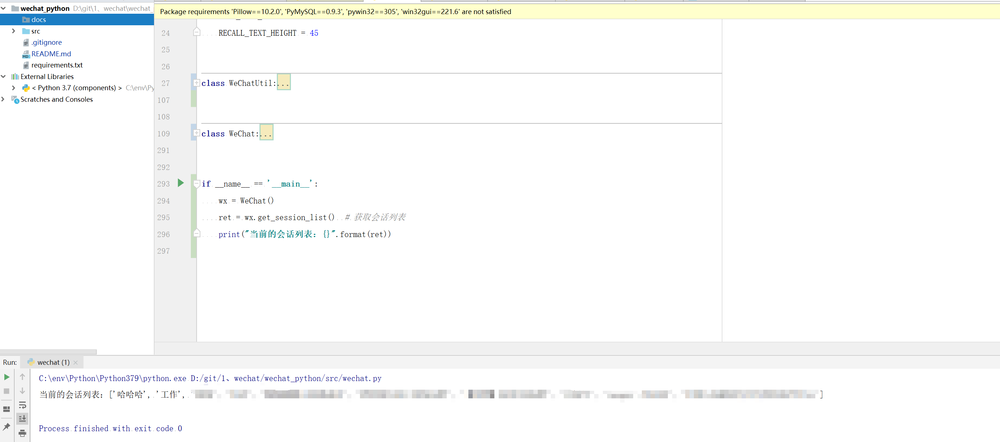

<h1 align="center">wechat-python</h1>

<p align="center">微信pc端自动化脚本 | wechat python</p>

***

# wechat_python

基于 Uiautomation 的 Windows 微信pc端自动化脚本。目前 **微信3.9.6** 版本可用。

实现的功能：

*   发送微信消息和微信群消息
*   接收微信消息和微信群消息
*   其他功能待开发中。。。


# 使用

1.  下载源码:

    ```
    https://github.com/flepeng/wechat_python.git
    ```

2.  安装依赖:

    ```
    pip install -r requirements.txt
    ```
  
3.  运行

    ```
    python src/wechat.py
    ```

4.  获取当前会话列表结果

    

5.  其他功能都在 `src/wechat.py` 文件中。 


# 免责声明

代码仅供交流学习使用，请勿用于非法用途和商业用途！如因此产生任何法律纠纷，均与作者无关！

